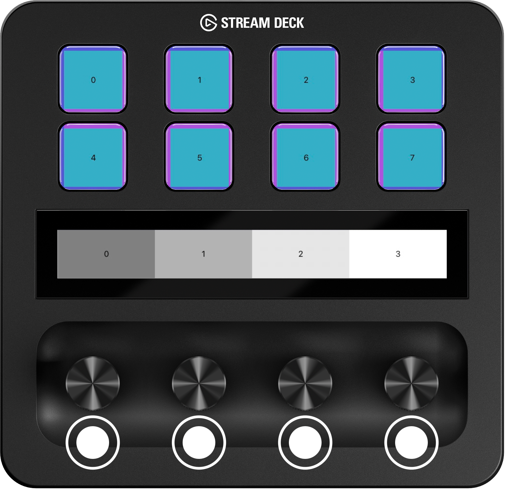
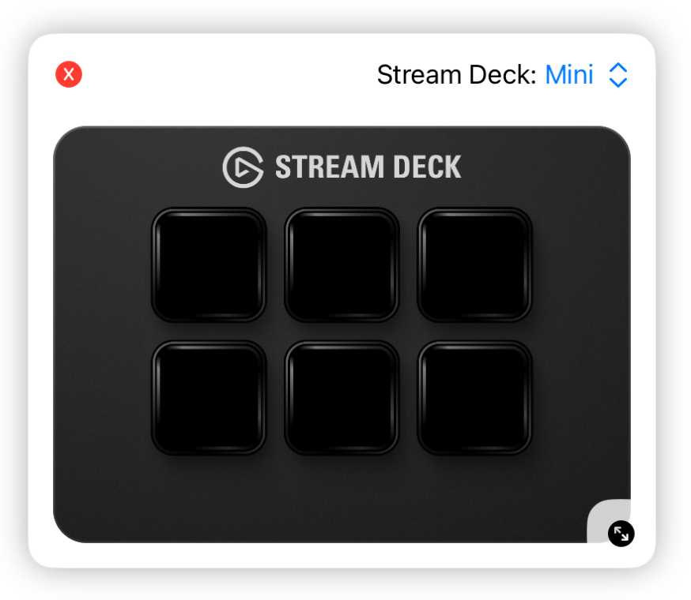

# Getting Started

Stream Deck Kit is a Swift Library for controlling physical [Elgato Stream Deck](https://www.elgato.com/stream-deck) devices with an iPadOS app.

## Features

All Stream Deck devices share the ability to subscribe to key up/down events. 

Additionally, devices equipped with LED keys offer the functionality of setting images onto keys, applying background images, and rendering keys and backgrounds using SwiftUI.

For devices featuring rotary encoders, it is possible to subscribe to rotation and up/down events. 

Devices with touch displays allow for rendering display content with SwiftUI.

## Prerequisites

To interact with a physical Stream Deck device, ensure you have the following:

- An iPad with a USB-C jack
- The [Elgato Stream Deck Connect](https://itunes.apple.com/de/app/elgato-stream-deck-connect/id6474433828) app installed
- The Stream Deck Device Driver enabled in iOS settings app (Refer to the in-app instructions for guidance)

On the other hand, if you want to verify your implementation using the [Stream Deck Simulator](#utilizing-the-simulator) only, no additional prerequisites are necessary.


During the alpha phase, the app is not in available in the App Store. [Click here to participate in the public alpha of Stream Deck Connect](https://testflight.apple.com/join/U4bWfk8O) in [TestFlight](https://developer.apple.com/testflight/).


| iOS Version | Swift Version | XCode Version |
| ----------- | ------------- | ------------- |
| >= 16       | >= 5.8        | >= 15         |

## Installation

### Swift Package Manager 

```swift
dependencies: [
    .package(url: "https://github.com/elgatosf/streamdeck-kit-ipad.git", upToNextMajor: "0.0.1")
]
```

### CocoaPods

Example Podfile

```Ruby
platform :ios, '16.0'

target 'YourAppTarget' do
    use_frameworks!
    pod 'StreamDeckKit'
    pod 'StreamDeckSimulator', :configurations => ['Debug']
end
```

## Getting started

Rendering content on a Stream Deck is very simple with SwiftUI, much like designing a typical app UI.

```swift
import StreamDeckKit

StreamDeckSession.setUp(newDeviceHandler: { $0.render(Color.blue) })
```

This code snippet demonstrates rendering a blue color across all buttons and displays on a device.


`StreamDeckSession` operates as a singleton, meaning you should invoke `setUp` only once throughout your application's life cycle.

 
### Rendering Layouts 

To render content on specific areas, utilize the `StreamDeckLayout` system with the `@StreamDeckView` Macro. `StreamDeckLayout` provides predefined layout views to position content on a Stream Deck. 

```swift
import StreamDeckKit

StreamDeckSession.setUp(newDeviceHandler: { $0.render(MyFirstStreamDeckLayout()) })
```

```swift
import SwiftUI 
import StreamDeckKit

@StreamDeckView
struct MyFirstStreamDeckLayout {

    var streamDeckBody: some View {
        StreamDeckLayout {
            // Define key area
            // Use StreamDeckKeyAreaLayout for rendering separate keys
            StreamDeckKeyAreaLayout { context in
                // Define content for each key.
                // StreamDeckKeyAreaLayout provides a context for each available key,
                // and StreamDeckKeyView provides a callback for the key action
                // Example:
                StreamDeckKeyView { pressed in
                    print("pressed \(pressed)")
                } content: {
                    Text("\(context.index)")
                        .frame(maxWidth: .infinity, maxHeight: .infinity)
                        .background(.teal)
                }
            }.background(.purple)
        } windowArea: {
            // Define window area
            // Use StreamDeckDialAreaLayout for rendering separate parts of the display
            StreamDeckDialAreaLayout { context in
                // Define content for each dial
                // StreamDeckDialAreaLayout provides a context for each available dial,
                // and StreamDeckDialView provides callbacks for the dial actions
                // Example:
                StreamDeckDialView { rotations in
                    print("dial rotated \(rotations)")
                } press: { pressed in
                    print("pressed \(pressed)")
                } touch: { location in
                    print("touched at \(location)")
                } content: {
                    Text("\(context.index)")
                        .frame(maxWidth: .infinity, maxHeight: .infinity)
                        .background(Color(white: Double(context.index) / 5 + 0.5))
                }
            }
        }.background(.indigo)
    }

}
```



For instructions on how to react to state changes, refer to [Stateful Layouts](Layout/Stateful.md).

### Utilizing the Simulator

The SDK is equipped with a fully operational simulator, providing a convenient way to to verify your implementation on various devices. However, we recommend to conduct testing on a real device as well. 


The simulator attaches to your running `StreamDeckSession`, mimicking the behavior of a regular device.


Executing this code presents the Stream Deck Simulator as an overlay featuring a simulated Stream Deck:

```swift
import StreamDeckSimulator

Button("Show Stream Deck Simulator") {
    StreamDeckSimulator.show()
}
```



For further instructions, refer to [Simulator](Simulator.md).

#### Previews

You can use Simulator in XCode Previews. 

```swift
#Preview {
    StreamDeckSimulator.PreviewView(streamDeck: .mini) {
        MyStreamDeckLayout()
    }
}
```

### Verify Stream Deck Connect Installation

In your app, consider addressing the scenario where Stream Deck Connect, and consequently, its driver, is not installed on the user's device. In such cases, you could prompt users with a message instructing users to install the app and enable the driver before utilizing your app with Stream Deck.

To determine if Stream Deck Connect is installed within your project, use the following snippet with `canOpenURL` and its scheme:

```swift
UIApplication.shared.canOpenURL(URL(string: "elgato-device-driver://")!)
```

Ensure to include `"elgato-device-driver"` in the `LSApplicationQueriesSchemes` section of your Info.plist file.

## Contribution

This project adheres to the [Contributor Covenant Code of Conduct](https://www.contributor-covenant.org/version/2/1/code_of_conduct/). By participating, you are expected to uphold this code. Please report unacceptable behavior to project owners.

## License

Stream Deck Kit is released under the MIT license. See [LICENSE](LICENSE) for details.