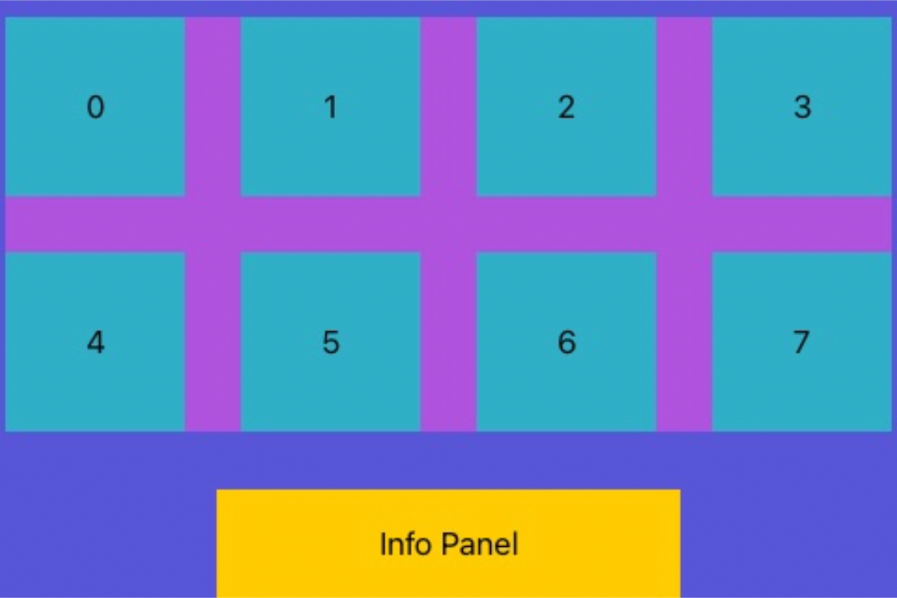
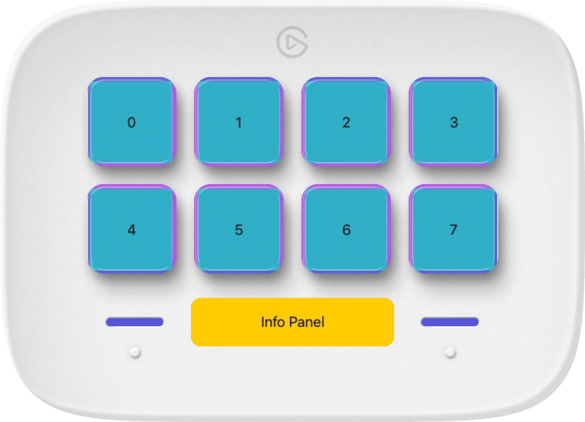

# The layout system

The `StreamDeckLayout` view is a fundamental component for building layouts for Stream Deck devices using SwiftUI. It provides a way to define the key area view with its keys and window view with its dials for a Stream Deck layout. This layout can be used to draw a customized layout onto a Stream Deck device and to recognize Stream Deck interactions in the SwiftUI way.

A `StreamDeckLayout` does the heavy lifting for you by automatically recognizing view updates, and triggering an update of the rendered image on your Stream Deck device.

The general structure of `StreamDeckLayout` is as follows:

```
StreamDeckLayout
└───keyArea: StreamDeckKeyAreaLayout
│   └───StreamDeckKeyView
└───windowArea: 
    └───StreamDeckDialAreaLayout
        └───StreamDeckDialView
    └───StreamDeckNeoPanelLayout
```

<figure>
    <picture>
        <source srcset="../_images/StreamDeckLayout.dark.svg" media="(prefers-color-scheme: dark)">
        
    </picture>
    <figcaption></figcaption>
</figure>


The window area is only available for the Stream Deck + and Stream Deck Neo, and will be ignored for other device types. For the Stream Deck Neo, the window area corresponds to the info panel only, excluding the touch buttons. 


## Usage
To use `StreamDeckLayout`, create an instance of it by specifying the key area and window views. Then, provide this instance to the `StreamDeck.render` method.

### Example

Here's an example of how to create a basic static `StreamDeckLayout`. For examples on how to create a stateful and an animated layout, see [Handling state changes](Stateful.md) and [Basic animations](Animated.md), respectively.

```swift
import SwiftUI 
import StreamDeckKit

struct StatelessStreamDeckLayout: View {

    var body: some View {
        StreamDeckLayout {
            // Define key area
            // Use StreamDeckKeyAreaLayout for rendering separate keys
            StreamDeckKeyAreaLayout { keyIndex in
                // Define content for each key.
                // StreamDeckKeyAreaLayout provides an index for each available key,
                // and StreamDeckKeyView provides a callback for the key action
                // Example:
                StreamDeckKeyView { pressed in
                    print("pressed \(pressed)")
                } content: {
                    Text("\(keyIndex)")
                        .frame(maxWidth: .infinity, maxHeight: .infinity)
                        .background(.teal)
                }
            }.background(.purple)
        } windowArea: {
            // Define window area
            if streamDeck.info.product == .plus {
                // Use StreamDeckDialAreaLayout for Stream Deck +
                StreamDeckDialAreaLayout { dialIndex in
                    // Define content for each dial
                    // StreamDeckDialAreaLayout provides an index for each available dial,
                    // and StreamDeckDialView provides callbacks for the dial actions
                    // Example:
                    StreamDeckDialView { rotations in
                        print("dial rotated \(rotations)")
                    } press: { pressed in
                        print("pressed \(pressed)")
                    } touch: { location in
                        print("touched at \(location)")
                    } content: {
                        Text("\(dialIndex)")
                            .frame(maxWidth: .infinity, maxHeight: .infinity)
                            .background(Color(white: Double(dialIndex) / 5 + 0.5))
                    }
                }
            } else if streamDeck.info.product == .neo {
                // Use StreamDeckNeoPanelLayout for Stream Deck Neo
                StreamDeckNeoPanelLayout { touched in
                    print("left key touched \(touched)")
                } rightTouch: { touched in
                    print("right key touched \(touched)")
                } panel: {
                    Text("Info Panel")
                }
                .background(.yellow)
            }
        }.background(.indigo)
    }

}

```

Depending on the device, the outcome will look like this:

<table>
    <tr>
        <td>Mini</td>
        <td>
            
            <strong>Note:</strong> On the Stream Deck Mini device, you can not set a complete screen image. However, the purple background on the key area would be visible if the keys had transparent areas.
        </td>
        <td></td>
    </tr>
    <tr>
        <td>Classic</td>
        <td></td>
        <td></td>
    </tr> 
    <tr>
        <td>XL</td>
        <td></td>
        <td></td>
    </tr> 
    <tr>
        <td>Plus</td>
        <td></td>
        <td></td>
    </tr> 
    <tr>
        <td>Neo</td>
        <td>
            
            <strong>Note:</strong> On the Stream Deck Neo device, you can not set images to the two touch key areas directly. However, you can change the appeareance of these by changing the background.  
        </td>
        <td></td>
    </tr> 
</table>


### SwiftUI Preview

You can use the `StreamDeckSimulator.PreviewView` (see [Simulator](../Simulator.md)) to view your layouts in the SwiftUI Preview canvas.
```swift
import StreamDeckSimulator

#Preview("Stream Deck +") {
    StreamDeckSimulator.PreviewView(streamDeck: .plus) { device in
        device.render(StatelessStreamDeckLayout())
    }
}

#Preview("Stream Deck Classic") {
    StreamDeckSimulator.PreviewView(streamDeck: .regular) { device in
        device.render(StatelessStreamDeckLayout())
    }
}
```
