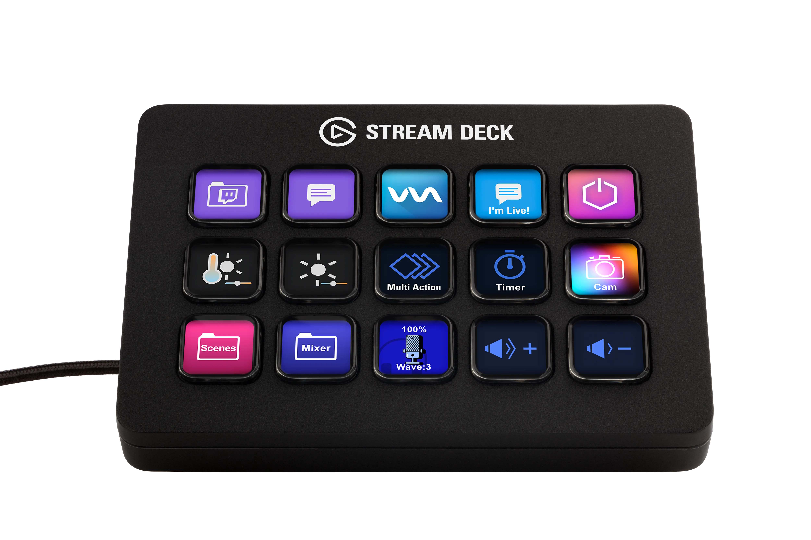
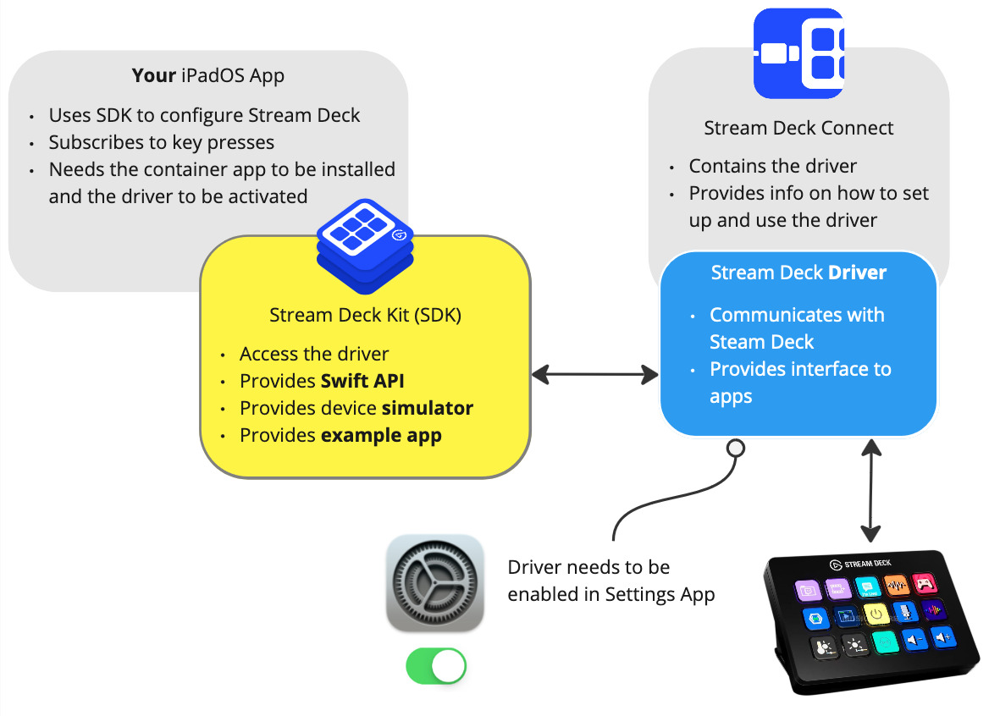

# Stream Deck Kit

With Stream Deck Kit, you gain full control over the [Stream Deck](https://www.elgato.com/stream-deck)'s capabilities while your app is in foreground, allowing you to tailor the user experience to your app's unique requirements. Whether it is triggering specific in-app actions, navigating menus, or launching functions, the possibilities are endless. It’s your app, your rules!

<figure>
    
    <figcaption>Stream Deck MK.2</figcaption>
</figure>

## Resources

- **Code**: [https://github.com/elgatosf/streamdeck-kit-ipad](https://github.com/elgatosf/streamdeck-kit-ipad)
- **API documentation**: [https://elgatosf.github.io/streamdeck-kit-ipad/docs/documentation/streamdeckkit](https://elgatosf.github.io/streamdeck-kit-ipad/docs/documentation/streamdeckkit)

Alongside the code, you will get a comprehensive [example app](https://github.com/elgatosf/streamdeck-kit-ipad/tree/main/Example) as well as a [simulator](Simulator.md) overlay to check out your implementation on different Stream Deck devices.

To begin, check out the repository or read the [Getting Started](GettingStarted.md) guide.

## Perks

In contrast to the iconic Stream Deck application on Desktop, which serves as a centralized hub for users to configure their Stream Deck(s), the Stream Deck for iPad SDK is tailored for a seamless plug-and-play experience on iPadOS. Here, your application takes control when it comes to the foreground, dictating the appearance and functions of the Stream Deck's buttons, and for the Stream Deck +, managing its rotary knobs and touchscreen interactions.

Our Stream Deck for iPad SDK is designed for easy integration into your iPad app, ensuring a smooth development process. Detailed documentation, examples and support from the Elgato Mobile Apps development team are provided to facilitate a hassle-free implementation.

## How does it work?

Users download the [Elgato Stream Deck Connect](https://itunes.apple.com/de/app/elgato-stream-deck-connect/id6474433828) App from the Apple App Store, which holds a driver for the Elgato Stream Deck devices, and are guided to activate the driver once within the iPadOS settings.

Going forward, they then are all set for using their Stream Deck(s) with any iPadOS application that integrates the Elgato Stream Deck for iPad SDK. You then can determine within your app if a Stream Deck is connected to the iPad using our SDK and manage it accordingly. Stream Deck(s) can be connected either directly to the iPad’s USB-C port or even via a (powered) USB hub.

<figure>
    
    <figcaption></figcaption>
</figure>