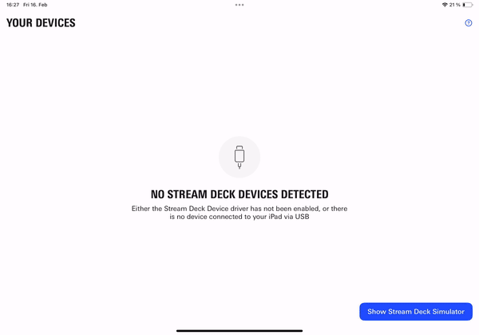

# Stream Deck Simulator
Integrate the Stream Deck Simulator into your iPadOS app for convenient testing of your implementation without the need for a physical Stream Deck device. This is especially useful when running your app in Apple's iPadOS Simulator, in SwiftUI Previews, or directly on your iPad particularly for Stream Deck devices that may not be readily accessible.


The Stream Deck Simulator is specifically designed as a development tool and is not intended to be visible to end-users of your app. Its primary purpose is to assist developers in the development process.


<figure>
    
    <figcaption>Different simulators for all supported Stream Deck devices, demonstrated in an example app.</figcaption>
</figure>

The Stream Deck Simulator replicates the behavior of a hardware Stream Deck, triggering key-down and key-up events through touch-down and touch-up inside a key. For the Stream Deck + Simulator, an additional button below each dial simulates the dial-press, and rotation of a dial and touch on the dial area respond to the respective gestures.

Moreover, the Stream Deck Simulator employs the same image rendering mechanism used before sending data to a hardware Stream Deck, providing an exact preview of what would be rendered on a real device.

<figure>
    
    <figcaption>In this example app, any interaction with the Stream Deck triggers a confetti of the same Emoji on the iPad.</figcaption>
</figure>

## Capabilities

The Stream Deck Simulator is displayed as a window above your app's content, allowing easy movement and resizing.

<figure>
    
</figure>

Additionally, you can toggle the visibility of the Simulator bezels and guides.


The guides illustrate the drawing areas for the keys and the dial areas and are never rendered on a real device.


<figure>
    
</figure>

## SwiftUI Preview

You can use the `StreamDeckSimulator.PreviewView` to view your [Layouts](Layout/README) in the SwiftUI Preview canvas.

```swift
import StreamDeckSimulator

#Preview("Stream Deck +") {
    StreamDeckSimulator.PreviewView(streamDeck: .plus) { device in
        device.render(MyStreamDeckLayout)
    }
}
```
