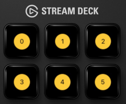
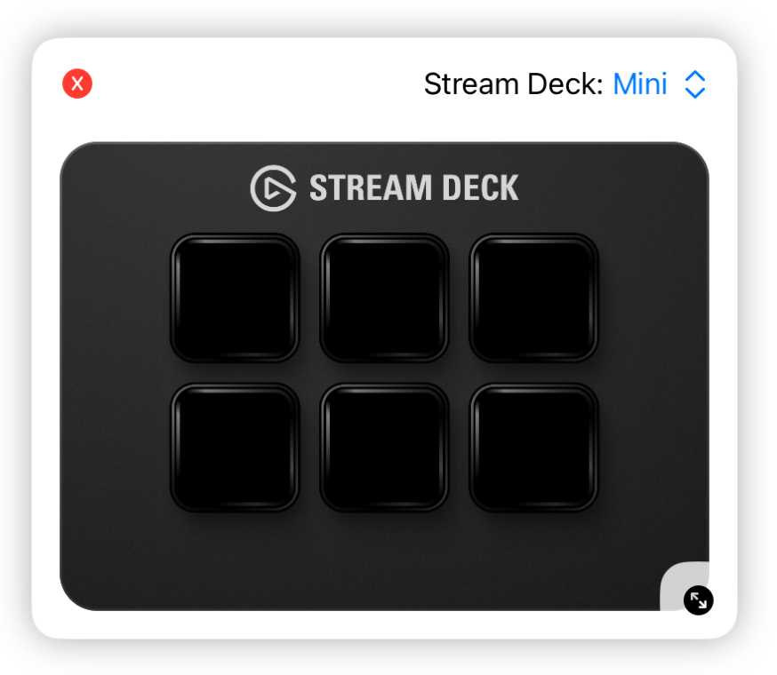

# StreamDeck Kit

Stream Deck Kit is a Swift Library for controlling physical [Elgato Stream Deck](https://www.elgato.com/stream-deck) devices with an iPadOS app.

<a href="https://github.com/elgatosf/streamdeck-kit-ipad/actions/workflows/run-tests.yml" alt="Run tests">
    
</a>

## Features

All Stream Deck devices:
- Subscribe to key up/down events

Devices with LED keys:
- Set images onto keys
- Set background images
- Render keys and backgrounds with SwiftUI

Devices with Rotary encoders:
- Subscribe to rotation and up/down events

Devices with touch displays:
- Draw onto touch display
- Render touch display content with SwiftUI

## Requirements

1. Install [Elgato Stream Deck Connect](https://itunes.apple.com/de/app/elgato-stream-deck-connect/id6474433828)
2. Enable the driver in system settings (Follow instructions in the app)

You can find out if the app is connected by trying to open an URL with its scheme:

```swift
UIApplication.shared.canOpenURL(URL(string: "elgato-device-driver://")!)
```

Be sure that you add "elgato-device-driver" to `LSApplicationQueriesSchemes` in your Info.plist file.

> [!NOTE]
> During the alpha phase, the app is not in available in the App Store. You can load it via the [TestFlight](https://developer.apple.com/testflight/) app. Use [this link [TODO: ADD LINK]](https://add.testflight/link/here) to participate in testing.


| iOS Version | Swift Version | XCode Version |
| ----------- | ------------- | ------------- |
| >= 16       | >= 5.8        | >= 15         |

## Getting started

To render content on a Stream Deck, you can use SwiftUI as you would in a regular app UI.

```swift
StreamDeckSession.setUp { _ in Color.blue }
```

This would show a blue color on all buttons and displays on a device.

### Rendering Keys

To render content on specific buttons, you can use the Layout system.


```swift
// Listing 1
import StreamDeckKit
StreamDeckSession.setUp { _ in
    StreamDeckLayout { _ in 
        StreamDeckKeypadLayout { context in
            Text("\(context.index)")
                .padding()
                .background { Circle().fill(.yellow) }
        }
    }
}
```
This uses predefined layout views to place content on a Stream Deck. 



The closure we passed to `StreamDeckLayout` defines the key area of the device. The closure we passed to `StreamDeckKeypadLayout` is a factory, providing a view for each LED key on the device. 

We can use the `index` property of the `context` parameter to find out which key is to be rendered.

### Handling actions

To handle presses on keys, you can use the `StreamDeckKeyView` as you would use a regular SwiftUI `Button`.

```swift
// Listing 2
StreamDeckKeyView { isDown in
    print(isDown ? "Key is down" : "Key is up")
} content: {
    Text("\(context.index)")
        .padding()
        .background { Circle().fill(.yellow) }
}
```

Replace the `Text` View in _Listing 1_ with _Listing 2_. This should log to console whenever a button is pressed on your Stream Deck.

### Using Context

The `StreamDeckViewContext` object provides you with Infos about the current device, it's capabilities and which possible key you are handling. You can access it via the parameter of the builder methods (see above) or the environment variable.

```swift
@Environment(\.streamDeckViewContext) var context
```

### Using the Simulator

#### Overlay

The SDK comes with a fully functional simulator that you can use to check your implementation on different devices. Although, we always recommend to check on a real device.

You can trigger the Stream Deck simulator like this:

```swift
import StreamDeckSimulator
Button("Show Stream Deck Simulator") {
    StreamDeckSimulator.show()
}
```

This will show an overlay with a simulated Stream Deck. You can switch between different devices with the menu in the upper right. There you can also toggle device bezels. There is also an option to render the exact borders of the button areas.



#### Preview

You can use Simulator in XCode previews as well. 

```swift
#Preview {
    StreamDeckSession.setUp { _ in
        // Your StreamDeckLayout implementation. See Listing 1.
    }

    return VStack {
        Text("Hello World!") // Your regular content
        StreamDeckSimulator.PreviewView(streamDeck: .mini)
    }
}
```

The simulator will automatically attach to your running session, and will behave just like a regular device.

## Installation

### Swift Package Manager 

```swift
dependencies: [
    .package(url: "https://github.com/elgatosf/streamdeck-kit-ipad.git", upToNextMajor: "0.0.1")
]
```

### CocoaPods

Example Podfile

```Ruby
platform :ios, '16.0'

target 'YourAppTarget' do
    use_frameworks!
    pod 'StreamDeckKit'
    pod 'StreamDeckSimulator', :configurations => ['Debug']
end
```

## Contribution

This project adheres to the [Contributor Covenant Code of Conduct](https://www.contributor-covenant.org/version/2/1/code_of_conduct/). By participating, you are expected to uphold this code. Please report unacceptable behavior to project owners.

## License

Stream Deck Kit is released under the MIT license. See [LICENSE](LICENSE) for details.
